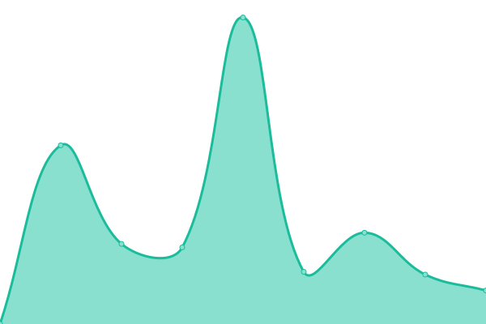
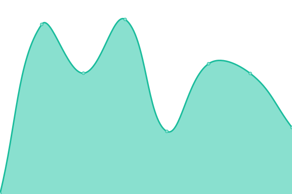
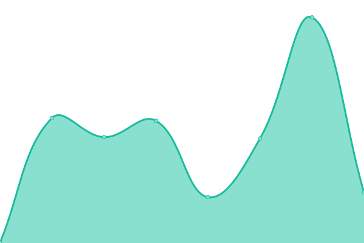

# [📈 Live Status](https://uptime.horus.dev): <!--live status--> **🟧 Partial outage**

This repository contains the open-source uptime monitor and status page for [Horus Lugo](https://horus.dev), powered by [Upptime](https://github.com/upptime/upptime).

With [Upptime](https://upptime.js.org), you can get your own unlimited and free uptime monitor and status page, powered entirely by a GitHub repository. We use [Issues](https://github.com/HorusGoul/upptime/issues) as incident reports, [Actions](https://github.com/HorusGoul/upptime/actions) as uptime monitors, and [Pages](https://uptime.horus.dev) for the status page.

<!--start: status pages-->
<!-- This summary is generated by Upptime (https://github.com/upptime/upptime) -->
<!-- Do not edit this manually, your changes will be overwritten -->
<!-- prettier-ignore -->
| URL | Status | History | Response Time | Uptime |
| --- | ------ | ------- | ------------- | ------ |
|  [steamdecktips.com](https://steamdecktips.com) | 🟥 Down | [steamdecktips-com.yml](https://github.com/HorusGoul/upptime/commits/HEAD/history/steamdecktips-com.yml) | 

 4244ms
     
 | 

<a href="https://uptime.horus.dev/history/steamdecktips-com">94.36%</a>
    

|  [trabajosoptica.com](https://trabajosoptica.com) | 🟥 Down | [trabajosoptica-com.yml](https://github.com/HorusGoul/upptime/commits/HEAD/history/trabajosoptica-com.yml) | 

 1722ms
     
 | 

<a href="https://uptime.horus.dev/history/trabajosoptica-com">94.36%</a>
    

|  [horus.dev](https://horus.dev) | 🟩 Up | [horus-dev.yml](https://github.com/HorusGoul/upptime/commits/HEAD/history/horus-dev.yml) | 

 445ms
     
 | 

<a href="https://uptime.horus.dev/history/horus-dev">100.00%</a>
    

|  [periodictable.pro](https://periodictable.pro) | 🟩 Up | [periodictable-pro.yml](https://github.com/HorusGoul/upptime/commits/HEAD/history/periodictable-pro.yml) | 

 269ms
     
 | 

<a href="https://uptime.horus.dev/history/periodictable-pro">100.00%</a>
    

<!--end: status pages-->

[**Visit our status website →**](https://uptime.horus.dev)

## 📄 License

- Powered by: [Upptime](https://github.com/upptime/upptime)
- Code: [MIT](./LICENSE) © [Horus Lugo](https://horus.dev)
- Data in the `./history` directory: [Open Database License](https://opendatacommons.org/licenses/odbl/1-0/)
